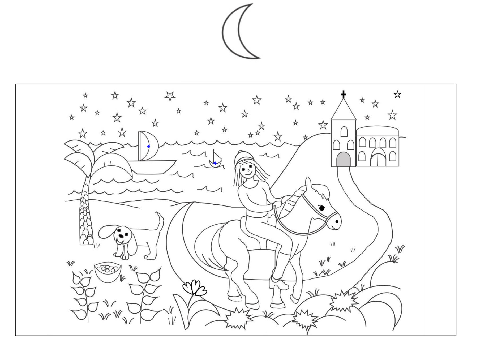

# KIND Disembedding Task

This is a [PsychoPy](https://psychopy.org/) implementation of a disembedding task created at Karolinska Institutet, Stockholm.

The experiment consists of trials where a cue image is displayed above a context image. The participant is to identify the target, as indicated by the cue, in the context image and click it. For some trials, the participant is to look for the same target in multiple locations in the context image. In other trials, there are different target stimuli hidden in the same context image.

As the participant clicks in the context image, small blue crosses are added which act as markers, to remind participants of where they have already clicked (and what targets they have already identified).

Instructions are presented both as text on the screen, and through recordings of the instructions being read out loud.

## Running the experiment
You must first find out the size of your monitor in centimers (width) and pixels (width/height), by e.g. looking in the user manual for your monitor. Then:

1. Download [PsychoPy](https://psychopy.org/).
2. Open up the file 'disembedding\_task\_noeyetracker\_version.psyexp' with PsychoPy Builder.
3. Go to the 'setup' routine, and click the 'code_monitor_setup'. Where indicated (with comments) in the 'Before Experiment' tab's code, insert your monitor's size (cm+pixels) and distance from participant (cm).
    - This is necessary for enabling proper resizing of experiment stimuli.
4. Click the 'run' button.
5. In the resulting dialog box: Enter a participant ID and an order group number (1-4).

The 'order group number' corresponds to what trial order should be used, as described in the CSV files in the 'order_specifications' directory.

## Experiment flow / trials
The experiment consists of 11 trials:
* 2 'repeat' trials: Here, the participant is to search for a _single_ shape that's been placed, with varying sizes and orientations, in different spots in the context image.
    - Here, participants have 90 seconds to find all targets, ending the trial - if the participant does not find all targets within 90s, the trial is automatically ended.
* 2 'heap' trials: This is similar to the 'repeat' trials. However, instead of using cartoonish context images of natural settings, targets are instead hidden in context images consisting of abstract shapes (e.g. trials, circles, etc.).
* 2 'once' trials: Here, the participant is to search for _different_ shapes, one at a time, that each only occur once in the context image.
    - Though there are 12 different types of shapes/targets, only one target shape is displayed at a time.
    - Participants are given 30 seconds _per target_ - if the participant does not find a target shape within 30s, the experiment automatically proceeds to the next target.
* 5 'popout' trials: Here, naturalistic setting context images are used. Unlike other trials with naturalistic settings, however, the targets in 'popout' trials are not embedded inside of other objects. Instead, targets have been placed so that they should be readily identifiable, with the intent that these trials form a control condition where no disembedding is needed.
    - 4 of the 'popout' trials have a single target (similar to regular 'repeat' trials).
    - 1 of the 'popout' trials has multiple targets, occuring one time each (similar to regular 'once' trials).

All trials include 12 targets (sometimes consisting of the same shape, sometimes being all of different shapes - see description of trial types above).

Trial order is determined by the selected 'order group number' - see the 'order_specifications' directory for details on this. When this task was used at Karolinska Institutet, the different orderings were used to vary the trial order while ensuring that different participant groups would get the different orderings with the same frequencies.

All trial order specifications put all the 'popout' trials at the end of the experiment. All orders also ensure one each of 'repeat'(R)/'heap'(H)/'once'(O) trials occurs before any of the types may be presented. Lastly, all orders ensure that trials of the same type (except 'popout') never occur 'back-to-back'. E.g. 'R-H-O-H-O-R' is a valid order, but orders like 'R-H-O-O-H-R' or 'R-H-R-O-H-O' are avoided.

## Translating the experiment
Both written and recorded instructions are in Swedish. If you wish to translate the experiment: 

1. Add a new directory to 'stimuli/audio\_read\_instructions/' with recordings corresponding to the files in 'stimuli/audio\_read\_instructions/swedish/'.
2. Open up the experiment .psyexp file with PsychoPy Builder. Open up the code snippet 'code\_translation\_' in the first routine ('setup').
3. Scroll down and replace the value assigned to `READ_AUDIO_DIR_PATH` with `stimuli/audio_read_instructions/YOUR_LANGUAGE_DIRECTORY_NAME`.
4. In the same code snippet, replace the instruction text strings with translations. 

## Changing other experiment configurations
Many aspects of the experiment (eg trial durations) can be reconfigured by opening up the experiment .psyexp file with PsychoPy Builder and changing values in the 'code\_setup\_' snippet in the 'setup' routine.

## (not) Running the experiment online
This experiment was only developed for local use, i.e. not with online use in mind. Since it uses much custom Python code, it is unlikely that one could easily convert it to JavaScript for being run online.

## Attribution
Stimuli, instructions (including recordings) and general outline of experiment flow were created by Elisabeth Nilsson Jobs and Janina Neufeld. Instruction recordings were performed by Elisabeth Nilsson Jobs. All implementation details were worked out and applied in PsychoPy by Lowe Wilsson. 

You are currently _not_ allowed to use this experiment in a research project (or for commercial purposes) unless explicit permission is given by Jobs and/or Neufeld.